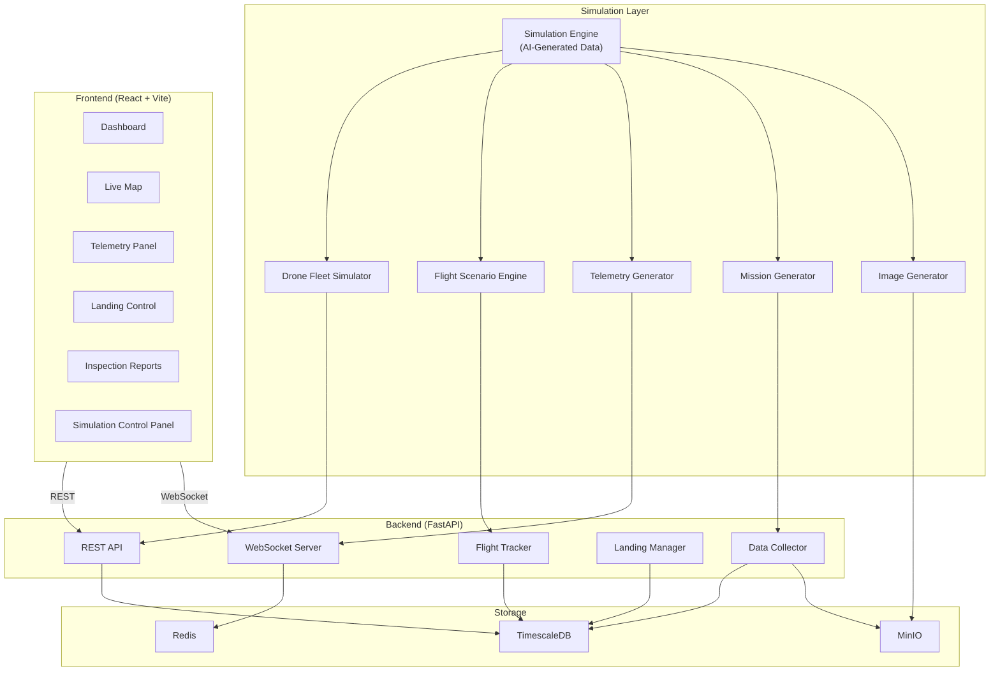

# Drone Receiving Platform — Current Status & Simulation Capability Plan

## Current Status Summary

The platform is a **drone inspection monitoring receiving station** (無人機巡檢監控接收站) with a well-structured foundation. The codebase has **scaffolded backend APIs, data models, services, and frontend pages**, but currently holds **no real data** and the frontend dashboard values are all hardcoded as `--`.

### Implementation Completeness

| Component | Status | Notes |
|-----------|--------|-------|
| **Data Models** (7 total) | ✅ Complete | `Drone`, `FlightRecord`, `TelemetryData`, `LandingPad`, `LandingSchedule`, `Mission`, `InspectionImage` |
| **REST API** (15+ endpoints) | ✅ Complete | CRUD for drones, flights, landings, missions, image upload |
| **WebSocket** (3 channels) | ✅ Complete | `telemetry`, `flights`, `landings` — with ping/pong & auto-reconnect |
| **Business Services** | ✅ Complete | `FlightTracker`, `LandingManager`, `DataCollector`, `MinioClient` |
| **ROS 2 Bridge** | ⚠️ Partial | Has mock-mode fallback for telemetry; image & mission subscribers enter **standby** without ROS 2 |
| **Frontend Dashboard** | ⚠️ Skeleton | 4 summary cards show `--`; no live data fetching on dashboard |
| **Frontend Telemetry** | ✅ Functional | Displays real-time telemetry via WebSocket |
| **Frontend Map** | ✅ Functional | Leaflet map with live drone marker via WebSocket |
| **Frontend Landing Control** | ✅ Functional | Lists landing pads from API with status badges |
| **Frontend Inspections** | ✅ Functional | Lists missions from API with status |
| **Data Simulation** | ⚠️ Minimal | Only `telemetry_sub.py` has a mock mode with random Taipei coords |
| **Docker Infrastructure** | ✅ Complete | TimescaleDB, Redis, MinIO, backend, frontend |
| **Authentication / Auth** | ❌ None | No auth layer |
| **Alerts / Notifications** | ⚠️ Partial | Battery alert logic exists in `FlightTracker`, but no UI for it |

---

## What This Platform Can Do (Current Functions)

### 1. 🚁 Drone Fleet Management
- Register new drones (name, model, serial number, max flight time)
- List / view active drones
- API: `POST/GET /api/v1/flights/drones`

### 2. ✈️ Flight Tracking & Telemetry
- Create / query flight records with status lifecycle: `scheduled → in_flight → approaching → landing → landed → completed / aborted`
- Receive & store time-series telemetry (lat, lon, alt, speed, heading, battery, signal) in **TimescaleDB**
- Real-time telemetry streaming via **WebSocket** (`/ws/telemetry`)
- Battery level alerts (warning < 20%, critical < 10%)
- API: `GET /api/v1/flights/`, `GET /api/v1/flights/{id}/telemetry`

### 3. 🛬 Landing Pad Control
- Register landing pads with coordinates, charger info, weight capacity
- Status management: `available → reserved → occupied → maintenance`
- Auto-assign available pads to incoming flights
- Schedule landings with priority
- Complete landings & release pads
- Real-time landing status via WebSocket (`/ws/landings`)
- API: `POST/GET /api/v1/landings/pads`, `POST/GET /api/v1/landings/schedules`

### 4. 📋 Mission & Inspection Data
- Create inspection missions linked to drones and flights
- Mission lifecycle: `created → in_progress → data_uploading → completed / failed`
- Upload inspection images to **MinIO** (S3-compatible object storage)
- Retrieve images with pre-signed URLs
- Mission status updates via WebSocket
- API: `POST/GET /api/v1/data/missions`, `POST /api/v1/data/missions/{id}/images`

### 5. 🗺️ Live Map Visualization
- Leaflet-based live map centered on Taipei
- Real-time drone position marker updated via WebSocket
- Popup with altitude, speed, battery info

### 6. 🔌 ROS 2 / DDS Bridge (Optional)
- Subscribes to ROS 2 topics for telemetry, images, and mission status
- Falls back to **mock mode** when ROS 2 is not installed

---

## Simulation Capability Plan

Since this is a **simulation platform** where all data will be AI-generated, here is the complete plan for what functions to implement:

### Phase 1: Core Simulation Engine (Backend)
> Replace the minimal mock mode with a comprehensive data simulation service

| Feature | Description |
|---------|-------------|
| **Drone Fleet Simulator** | Auto-generate 3–5 virtual drones with realistic specs (DJI Matrice, Mavic, etc.) on system startup |
| **Flight Scenario Engine** | Generate complete flight lifecycles: takeoff → waypoint navigation → approach → landing → mission complete. Each flight follows a realistic GPS path with altitude/speed curves |
| **Telemetry Stream Simulator** | Generate rich telemetry at 1 Hz per drone: smooth GPS trajectories (not random), altitude profiles, battery drain curves, signal strength variations, realistic heading changes |
| **Landing Sequence Simulator** | Simulate approach patterns, pad reservation, precision landing, and pad release sequences |
| **Mission Data Generator** | Auto-create inspection missions with progress updates, waypoint tracking, and completion events |
| **Inspection Image Generator** | Generate or use template inspection images (solar panels, power lines, bridges) to simulate camera captures stored in MinIO |

### Phase 2: Dashboard & UI Completion

| Feature | Description |
|---------|-------------|
| **Live Dashboard Stats** | Wire dashboard cards (Active Drones, Active Flights, Available Pads, Today's Missions) to live API data |
| **Telemetry Charts** | Add time-series charts using `recharts` (already a dependency) for altitude, battery, speed over time |
| **Multi-Drone Map** | Show all active drones simultaneously on the map with different colored markers and flight path trails |
| **Landing Pad Map Overlay** | Display landing pads on the map with status-colored markers |
| **Alert Panel** | UI component for real-time battery/signal alerts with severity badges |
| **Mission Progress Bar** | Show waypoint progress (e.g., "Waypoint 5/12 — 42%") in real-time |

### Phase 3: AI-Generated Data Integration

| Feature | Description |
|---------|-------------|
| **AI Inspection Report Generator** | Generate descriptive inspection reports with findings (e.g., "Panel A3 — crack detected, severity: moderate") using AI text generation |
| **AI Image Annotation** | Simulate defect detection annotations on inspection images (bounding boxes, labels) |
| **Anomaly Simulation** | Occasionally inject anomalies: sudden battery drops, GPS drift, signal loss, emergency returns |
| **Weather Simulation** | Generate weather conditions that affect flight parameters (wind → heading drift, rain → reduced visibility) |
| **Historical Data Backfill** | Generate weeks of historical flight/mission data for querying and analytics |

### Phase 4: Advanced Features

| Feature | Description |
|---------|-------------|
| **Simulation Control Panel** | UI to start/stop/pause simulations, adjust speed (1x, 2x, 5x), add/remove drones |
| **Scenario Presets** | Pre-built scenarios: "routine solar farm inspection", "emergency bridge check", "multi-drone power line survey" |
| **Data Export** | Export simulated data as CSV/JSON for analysis |
| **Replay Mode** | Replay past simulated sessions with timeline scrubbing |
| **API for External AI** | REST endpoint to accept AI-generated data from external systems (e.g., call an LLM API to generate inspection text) |

---

## Architecture Diagram

---

## Recommended Implementation Order

1. **Phase 1A** — Build `SimulationEngine` service with drone & telemetry generation (replaces current mock mode)
2. **Phase 1B** — Add flight lifecycle & landing simulation
3. **Phase 2A** — Wire dashboard stats + add telemetry charts
4. **Phase 2B** — Multi-drone map + landing pad visualization
5. **Phase 3A** — AI-generated inspection reports + anomaly injection
6. **Phase 4** — Simulation control panel + scenario presets
